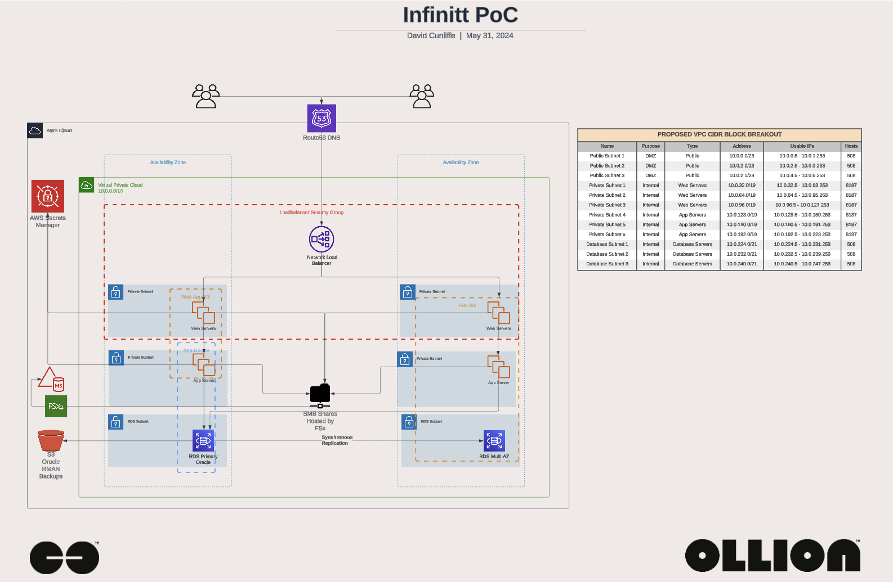

# OLLION-PS-NA-TF-AWS-INFINITT-APP-POC

This repository is a POC for the Infinitt application deployment on AWS using Terraform. This repository is designed to deploy common resources for infrastrucutre making repeated deployments easier and faster or deployments between environments and regions uniform.

## Table of Contents

- [OLLION-PS-NA-TF-AWS-INFINITT-APP-POC](#ollion-ps-na-tf-aws-infinitt-app-poc)
  - [Table of Contents](#table-of-contents)
  - [TODO](#todo)
  - [Overview](#overview)
  - [Prerequisites](#prerequisites)
  - [Getting Started](#getting-started)
  - [License](#license)

## TODO

- [ ] Update Application Module to add Backend Application Server as part of deployment
- [ ] Update naming conventions for resources
- [ ] Update tagging for resources
- [ ] Add documentation for the EC2 Image Builder Creation Modules

## Overview



This repository is designed to deploy the Infinitt application on AWS using Terraform. The repository is designed to deploy a two stage build the base infrastructure and application deployment. The base infrastructure is designed to deploy the VPC, Subnets, Generic Security Groups, FSx, AWS Managed AD and supporting IAM roles. The application deployment is designed to deploy the EC2 instances and optionally the RDS instance.

The base infrastructure is required to be deployed first before the application deployment can be deployed. The base infrastructure is designed to be deployed once and support mulitple application deployments. There is enough space in the private subnets to support hundreds of individual application groups. The base infrastructure deployment has some standard resources that get deployed as part of the build which are the folowing:

- VPC
- Public Subnets for Network Load Balancer(s)
- Private Subnets for EC2 Application workloads and Infrastructure related services such as FSx and Managed AD
- Database Subnets for RDS instances or other database services that reside on EC2 instances
- FSx File System for shared application data
- Managed AD for the FSx File System
- EC2 Server for management of AD and FSx File System resources
- IAM Roles for EC2 instances to access the FSx File System and Managed AD

For the Application deployment, there is a Network Load Banacer which gets deployed with each module. The Network Load Balancer can work with the various target groups to deploy multiple applications using different ports and allow for passthrough of private certificates hosted on the web servers. The RDS service is optionally deployed through the application module oracle standard edition two and is deployed in the database subnets. The application module will deploy the following resources:

- EC2 instances for the web servers
- RDS instance for the database
- Security Groups for the EC2 instances and RDS instance
- Target Groups for the Network Load Balancer
- Listener Rules for the Network Load Balancer
- Network Load Balancer

## Prerequisites

- [Terraform](https://www.terraform.io/downloads.html)
- [AWS CLI](https://aws.amazon.com/cli/)
- [AWS Account](https://aws.amazon.com/account/)
- [AWS IAM User](https://docs.aws.amazon.com/IAM/latest/UserGuide/id_users.html)
- [AWS IAM Managed Administrative Role](https://docs.aws.amazon.com/IAM/latest/UserGuide/id_roles_manage.html)
- [AWS S3 Bucket](https://docs.aws.amazon.com/AmazonS3/latest/gsg/CreatingABucket.html)
- [AWS DynamoDB Table](https://docs.aws.amazon.com/amazondynamodb/latest/developerguide/Introduction.html)

## Getting Started

This repository is using environment variables to set the AWS region and AWS profile setup in your local environment. The following environment variables are required:

- `AWS_REGION` - The AWS region to deploy the resources
- `AWS_ACCESS_KEY_ID` - The AWS access key ID for the IAM user
- `AWS_SECRET_ACCESS_KEY` - The AWS secret access key for the IAM user

The following steps are required to deploy the resources:

1. Clone the repository
2. Change directory to the repository
3. If you already have a State file location (S3) and Dynamo DB staged skip this step otherwise. Initialize the Terraform bootstrap module to create the S3 bucket and DynamoDB table for the Terraform state file located in `bootstrap` directory. The bootstrap module will create the S3 bucket and DynamoDB table for the Terraform state file. The bootstrap module will create the S3 bucket and DynamoDB table for the Terraform state file since Github can't manage state. There are other ways to manage your state please review the [Terraform documentation](https://www.terraform.io/docs/language/settings/backends/index.html) for more information. Below is a sample of how to initialize the bootstrap module, please make sure to change the `terraform.tfvars` file to match your environment:

```bash
cd terraform/modules/boot-strap

cat <<EOF > terraform.tfvars
env               = "dev"
region            = "ca-central-1"
dynamodb_table    = "ollion-test-terraform-state-lock"
tags = {
  Environment = "dev"
  Owner       = "ollion"
}

# bucket will recieve a unique id appended to the name ensure you add a - at the end
state_bucket_name = "ollion-terraform-state-bucket-"

# This sets the bucket as false for force destroy, reapply as true before tearing down environment
state_bucket_destroy = false
EOF

terraform init
terraform apply

# Truncated output
# Apply complete! Resources: 3 added, 0 changed, 3 destroyed.

#Outputs:

#dynamic_table = "ollion-test-terraform-state-lock"
#dynamic_table_arn = "arn:aws:dynamodb:ca-central-1:012345678910:table/ollion-test-terraform-state-lock"
#s3_bucket = "ollion-terraform-state-bucket-20240531120521413500000001"
#s3_bucket_arn = "arn:aws:s3:::terraform-state-bucket-20240531120521413500000001"
#s3_bucket_region = "ca-central-1"
#tags = tomap({
#  "Environment" = "dev"
#  "Owner" = "ollion"
#})
```

4. Apply the Terraform modules

This is a two part deployment, the first part is to deploy the VPC, Subnets, Generic Security Groups, FSx, AWS Managed AD and supporting IAM roles. The second part is to deploy the EC2 instances and the RDS instance. The first part is required to be deployed first before the second part can be deployed. Below is a sample of how to deploy the first part. This sample below is to update the values required by the workflow not discussed as part of this deployment please review the [Terraform documentation](https://developer.hashicorp.com/terraform/tutorials/automation/github-actions) for more information. The following steps are required to deploy the resources locally, but this repository is staged to automate this deployment using Github Actions. Below is a sample of how to deploy the first part of the deployment locally, please make sure to change the `env-var-ca-central1-dev.tfvars` file to match your environment:

```bash
git clone git@github.com:ollionorg/ollion-ps-na-tf-aws-infinitt-app-poc.git
cd ollion-ps-na-tf-aws-infinitt-app-poc/terraform/env/networking

cat <<EOF > env-var-ca-central1-dev.tfvars
environment                      = "dev"
region                           = "ca-central-1"
state_bucket                     = "tfstate-s3-bucket"
state_bucket_key_path            = "states/tf-infinitt-app-poc/application/terraform.tfstate"
dynamodb_table                   = "tf-infinitt-app-poc-lock"
vpc_cidr_block                   = "10.0.0.0/16"
vpc_public_subnets               = ["10.0.0.0/23", "10.0.2.0/23", "10.0.4.0/23"]
vpc_public_subnet_names          = ["Public Subnet One", "Public Subnet Two", "Public Subnet Three"]
vpc_private_subnets              = ["10.0.32.0/19", "10.0.64.0/19", "10.0.96.0/19", "10.0.128.0/19", "10.0.160.0/19", "10.0.192.0/19"]
vpc_private_subnet_names         = ["Private Subnet One", "Private Subnet Two", "Private Subnet Three", "Intra Subnet One", "Intra Subnet Two", "Intra Subnet Three"]
vpc_database_subnets             = ["10.0.224.0/21", "10.0.232.0/21", "10.0.240.0/21"]
vpc_database_subnet_names        = ["DB Subnet One", "DB Subnet Two", "DB Subnet Three"]
create_database_subnet_group     = true
ad_name                          = "example.com"
ad_log_retention_in_days         = 30
kms_key_deletion_window_in_days  = 30
kms_key_enable_rotation          = true
kms_key_name                     = "infinitt-fsx-key"
fsx_file_system_name             = "infinitt-file-system"
fsx_deployment_type              = "SINGLE_AZ_2"
fsx_storage_type                 = "SSD"
ad_manager_instance_type         = "t3a.large"
ad_manager_instance_ec2_key_name = "infinitt-test-ssh"
tags = {
  ApplicationName = "poc-infinitt"
  GithubRepo      = "ollion-ps-na-tf-infinit-app-poc"
  GithubOrg       = "OllionOrg"
}
EOF

export TF_VAR_region=ca-central-1
export TF_VAR_state_bucket=tfstate-s3-bucket
export TF_VAR_state_bucket_key_path=states/tf-infinitt-app-poc/networking/terraform.tfstate
export TF_VAR_dynamodb_table=tf-infinitt-app-poc-lock

terraform init \
--backend-config "region=$TF_VAR_region" \
--backend-config "bucket=$TF_VAR_state_bucket" \
--backend-config "key=$TF_VAR_state_bucket_key_path" \
--backend-config "dynamodb_table=$TF_VAR_dynamodb_table"

terraform plan -var-file=env-var-ca-central1-dev.tfvars
terraform apply -var-file=env-var-ca-central1-dev.tfvars && curl -d "Network Build Completed" ntfy.sh/Ollion-DCC-IaCBuild

cd ../application

cat <<EOF > env-var-ca-central1-dev.tfvars
environment                      = "dev"
region                           = "ca-central-1"
state_bucket                     = "tfstate-s3-bucket"
state_bucket_key_path            = "states/tf-infinitt-app-poc/application/terraform.tfstate"
dynamodb_table                   = "tf-infinitt-app-poc-lock"
networking_region                = "ca-central-1"
networking_state_bucket          = "tfstate-dcc"
networking_state_bucket_key_path = "states/tf-infinitt-app-poc/application/terraform.tfstate"
networking_dynamodb_table        = "tf-infinitt-app-poc-lock"
ec2_key_name                     = "infinitt-test-ssh"
tags = {
  ApplicationName = "poc-infinitt"
  GithubRepo      = "ollion-ps-na-tf-infinit-app-poc"
  GithubOrg       = "OllionOrg"
}
EOF

export TF_VAR_region=ca-central-1
export TF_VAR_state_bucket=tfstate-s3-bucket
export TF_VAR_state_bucket_key_path=states/tf-infinitt-app-poc/application/terraform.tfstate
export TF_VAR_dynamodb_table=tf-infinitt-app-poc-lock

terraform init \
--backend-config "region=$TF_VAR_region" \
--backend-config "bucket=$TF_VAR_state_bucket" \
--backend-config "key=$TF_VAR_state_bucket_key_path" \
--backend-config "dynamodb_table=$TF_VAR_dynamodb_table"

terraform plan -var-file=env-var-ca-central1-dev.tfvars
terraform apply -var-file=env-var-ca-central1-dev.tfvars && curl -d "Application Build Completed" ntfy.sh/Ollion-DCC-IaCBuild
```

## License

This project is licensed under the MIT License - see the [LICENSE](./MIT-LICENSE.txt) file for details.
